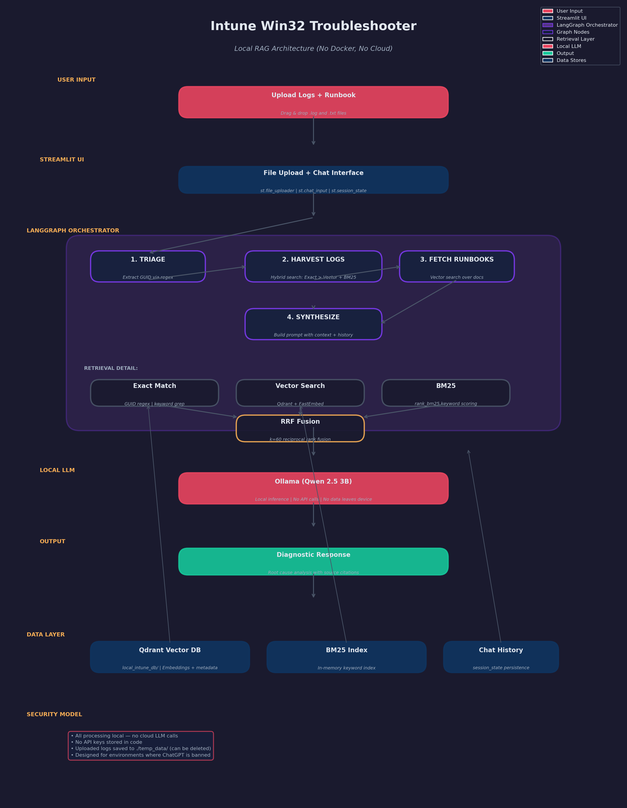

# Intune Win32 Troubleshooter

> Local RAG diagnostic engine for Intune Win32 app deployment failures. Built because I was tired of grepping through 4 log files at 2 AM.



## Why I Built This

If you've ever troubleshooted Win32 app deployments in Intune, you know the pain:
- `IntuneManagementExtension.log` 
- `AppWorkload.log`
- `AgentExecutor.log`
- `ClientHealth.log`

Four files. Six deployment phases. Zero correlation. You spend 20 minutes manually grepping GUIDs and cross-referencing Microsoft docs just to find out a detection rule failed.

I built this to automate that grunt work. Everything runs locally because these logs contain device IDs, user names, and tenant info that should never hit a cloud LLM.

## What It Does

Upload your Intune logs + a runbook (plain text docs explaining your Win32 packaging process). Then ask questions like:

- `Why did app 12345678-1234-1234-1234-123456789abc fail?`
- `What happened during the detection phase?`
- `Compare the logs against our runbook -- did we miss a dependency?`

The AI traces the Win32 lifecycle (Applicability → Detection → Download → Decryption → Execution → Reporting) and tells you exactly where things broke.

## Architecture

```
User Query
    ↓
[Triage] -- Extracts GUID if present
    ↓
[Log Retrieval] -- Hybrid search (Exact GUID match > Vector + BM25 fusion)
    ↓
[Runbook Retrieval] -- Semantic search over your documentation
    ↓
[Synthesis] -- Local LLM (Ollama) generates RCA
    ↓
Response + Source Citations
```

**Key design decisions:**
- **Dual RAG**: Device logs and runbooks are separate retrievers. Logs need keyword-heavy hybrid search (error codes don't embed well). Runbooks work fine with pure vector search.
- **Phase-aware**: Every log chunk is tagged with its Win32 deployment phase. The AI knows if you're in Detection vs Execution.
- **Context expansion**: When we find a relevant log line, we grab the next 3 lines from the same file for chronological context.
- **Local-only**: Ollama + Qdrant + FastEmbed. No OpenAI. No Azure AI. No data leaves your machine.

## Quick Start

### Prerequisites
- Python 3.10+
- [Ollama](https://ollama.com) installed and running
- A model pulled (tested with `qwen2.5:3b`, also works with `llama3.2`, `phi4`)

```bash
# 1. Clone
git clone https://github.com/yourname/intune-win32-troubleshooter.git
cd intune-win32-troubleshooter

# 2. Install deps
pip install -r requirements.txt

# 3. Make sure Ollama is running
ollama pull qwen2.5:3b
ollama serve

# 4. Run
streamlit run app.py
```

### Using It

1. **Upload logs** in the sidebar (`.log` files from `C:\ProgramData\Microsoft\IntuneManagementExtension\Logs`)
2. **Upload a runbook** (`.txt` file explaining your Win32 packaging standards)
3. Click **Initialize Agent** -- this builds the vector indexes (takes ~30-60s for large logs)
4. Chat away in the main window

## Screenshots

*(Will add once I clean up the UI a bit -- right now it's functional but ugly)*

## Tech Stack

| Component | Purpose |
|-----------|---------|
| Streamlit | Web UI (quick and dirty, I'm not a frontend dev) |
| LangGraph | Orchestration -- deterministic workflow, not just "call LLM and pray" |
| Qdrant | Local vector DB for embeddings |
| FastEmbed | Local embeddings (BAAI/bge-small-en-v1.5) -- no API calls |
| BM25Okapi | Keyword retrieval for error codes and GUIDs |
| Ollama | Local LLM inference |

## Known Issues / Limitations

- **.evtx files**: Only works on Windows since it uses `wevtutil`. On Linux/Mac, stick to `.log` files.
- **No memory across sessions**: If you refresh the browser, indexes are rebuilt. I know, I should persist Qdrant. It's on the TODO.
- **Single-user only**: Streamlit session state is per-browser. Don't share the URL expecting multi-user support.
- **BM25 is keyword-only**: If you ask "why is my app slow" and the log says "high CPU utilization", it might miss. Semantic search catches it, but not perfectly. For IT logs with consistent error codes, this is usually fine.
- **Runbook quality matters**: Garbage in, garbage out. If your runbook is vague, the AI will be vague.

## TODO

- [ ] Add persistent Qdrant storage so we don't re-index on every refresh
- [ ] Support `.evtx` on Linux via python-evtx parser
- [ ] Add export button (PDF/txt of the conversation for ticket documentation)
- [ ] Better error handling when Ollama isn't running
- [ ] Maybe a dark mode? Streamlit makes this surprisingly hard
- [ ] Docker container for one-command deployment

## Security Notes

- All processing is local. No API keys. No cloud inference.
- Uploaded files are saved to `./temp_data/` and can be deleted after use.
- Designed for environments where you legally cannot paste logs into ChatGPT.

## About Me

6 years in Intune/Endpoint Management. Self-taught Python. This is my first "real" AI project -- built it to solve a problem I actually have, not to pad a resume. If you find bugs, open an issue. I probably caused them.
